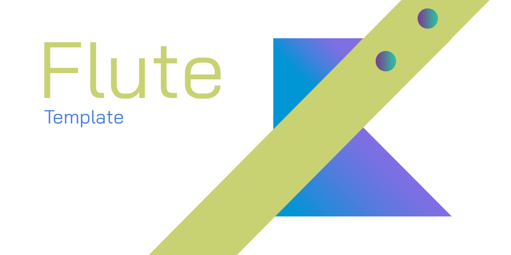

[.custom-toc]
--
[cols="1a", frame="none", grid="none"]
|===
| **Table of Contents**

* <<introduction,Introduction>>
* <<project-structure,Project Structure>>
* <<customize,Customizing Your App>>
  ** <<change-name,Change the App Name & Icon>>
  ** <<theme,Update Colors & Theme>>
  ** <<content,Build Your Content>>
* <<example,Example: Adding a Button>>
* <<help,Need Help?>>
* <<license,License>>
|===
--

[id="introduction"]
== Introduction

Flute is a Kotlin Multiplatform project combining Desktop and Mobile app development with both shared ui and logic (though separable). Unlike the JetBrains templates, it provides a more updated and clean structure, with a small and easily replaceable initial setup.

[id="project-structure"]
== Project Structure
[source,plaintext]
----
Flute/
├── androidApp/                                   # Android application module
│   └── src/
│       └── main/
│           ├── AndroidManifest.xml               # Android app manifest
│           ├── kotlin/                           # Android-specific Kotlin code
│           └── res/                              # Android resources
├── desktopApp/                                   # Desktop JVM application module
│   └── src/
│       └── jvmMain/
│           └── kotlin/                           # Desktop-specific Kotlin code
├── shared/                                       # Shared Kotlin Multiplatform module
│   └── src/
│       ├── commonMain/                           # Shared code for all platforms
│       │   ├── composeResources/                # Shared Compose resources
│       │   └── kotlin/                          # Shared Kotlin code
│       ├── androidMain/                          # Android-specific shared code
│       │   ├── AndroidManifest.xml
│       │   └── kotlin/                          # Android-specific shared Kotlin code
│       └── iosMain/                              # iOS-specific shared code
│           └── kotlin/                          # iOS-specific shared Kotlin code
├── iosApp/                                       # Native iOS wrapper app
│   └── iosApp/
│       ├── ContentView.swift                     # Bridges Compose UI into SwiftUI
│       ├── iOSApp.swift                          # iOS app entry point
│       ├── Info.plist                            # iOS app metadata
│       └── Assets.xcassets/                      # iOS asset catalog
├── gradle/                                       # Gradle wrapper and version catalog
├── build.gradle.kts                              # Root Gradle build configuration
├── settings.gradle.kts                           # Gradle project settings
└── README.adoc                                   # Project documentation
----

[id="customize"]
== Customizing Your App

[id="change-name"]
=== 1. Change the App Name & Icon

* Lowk this step is the most annoying, so I'd suggest just searching for every instance of "Flute" and replacing it along with the package path.
* Replace icons in `androidApp/src/main/res/mipmap-*`.

[id="theme"]
=== 2. Update Colors & Theme

* Update theming in `shared/src/commonMain/kotlin/xyz/malefic/flute/App.kt`.
* Also note that the Android app uses the cool dynamic theming from Material You, so you can remove that if you want a more consistent cross-platform look.

[id="content"]
=== 3. Build Your Content

* Edit `shared/src/commonMain/kotlin/xyz/malefic/flute/EmptyScreen.kt` or `shared/src/commonMain/kotlin/xyz/malefic/flute/DemoScreen.kt`.
* Add new screens in `shared/src/commonMain/kotlin/xyz/malefic/flute/` and wire them into `App.kt`.

[id="example"]
== Example: Adding a Button

[source,kotlin]
----
@Composable
fun MainScreen() {
    var count by remember { mutableStateOf(0) }
    Column {
        Text("You've clicked $count times")
        Button(onClick = { count++ }) {
            Text("Click me!")
        }
    }
}
----

[id="help"]
== Need Help?

* Reach out to me! You can find all my info on my GitHub profile: https://github.com/OmyDaGreat[OmyDaGreat].

[id="license"]
== License

This project is licensed under the MIT License. See link:LICENSE[] for details.
